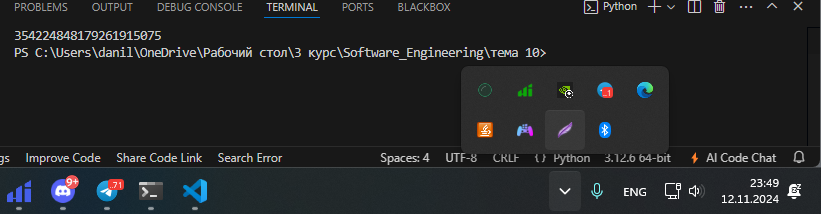
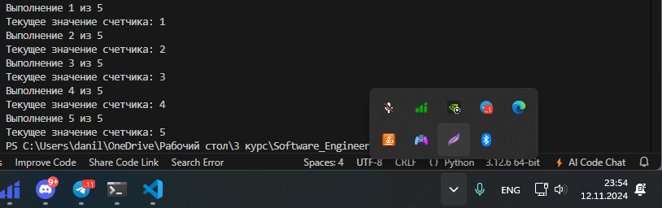

# Тема 10. Декораторы и исключения
Отчет по Теме #10 выполнил:
- Галанов Данил Николаевич
- ПИЭ-22-1

| Задание | Лаб_раб | Сам_раб |
| ------ |---------|---------|
| Задание 1 | +       | +       |
| Задание 2 | +       | +       |
| Задание 3 | +       | +       |
| Задание 4 | +       | +       |
| Задание 5 | +       | +       |

знак "+" - задание выполнено; знак "-" - задание не выполнено;

Работу проверили:
- к.э.н., доцент Панов М.А.

## Лабораторная работа №1


```python
from functools import lru_cache


@lru_cache(None)
def fibonacci(n):
    if n == 0:
        return 0
    elif n == 1:
        return 1
    return fibonacci(n - 1) + fibonacci(n - 2)

print(fibonacci(100))
```
### Результат.



### Выводы

Декоратор @lru_cache сохраняет результаты вызова функции, чтобы при повторных вычислениях использовать кеш, а не вычислять заново, что ускоряет выполнение.

## №2


```python
def check(input_func):
    def output_func(*args):
        name, age = args[0], args[1]

        if age < 0 or age > 130:
            age = 'Недопустимый возраст'
        input_func(name, age)

    return output_func


@check
def personal_info(name, age):
    print(f"Name: {name} Age: {age}")

personal_info('Владимир', 38)
personal_info('Александр', -5)
personal_info('Петр', 138, 15, 48, 2)
```
### Результат.


### Выводы

Код проверяет возраст через декоратор check. Если возраст не в диапазоне 0–130, выводится "Недопустимый возраст". Третий вызов функции ошибочен из-за лишних аргументов.

## №3

```python
def data(*args):
    try:
        for i in range(len(*args)):
            try:
                result = (args[0][i] * 15) // 10
                print(result)
            except Exception as ex:
                print(ex)
    except Exception as ex:
        print(ex)
    finally:
        print('Вся информация обработана')

data([1, 15, 'Hello', 'i', 'try', 'to', 'crash', 'your', 'site', 38, 45])
```
### Результат.


### Выводы

Этот код принимает список, умножает каждый элемент на 15 и делит на 10, выводя результат. Если элемент нельзя умножить (например, текст), выбрасывается ошибка, и она обрабатывается внутри вложенного try. В конце всегда выводится сообщение "Вся информация обработана".
  
## №4

```python
class NegativeValueException(Exception):
    pass

def check_name(name):
    if len(name) > 10:
        raise NegativeValueException('Длина более 10 символов')
    else:
        print('Успешная регистрация')

name = '123456788910'
check_name(name)
```
### Результат.


### Выводы


Этот код создает пользовательское исключение NegativeValueException, которое вызывается, если длина имени превышает 10 символов.

Функция check_name: проверяет длину имени. Если больше 10 символов, вызывается исключение NegativeValueException с сообщением "Длина более 10 символов". Если имя подходит, выводится "Успешная регистрация".
В данном случае вызов check_name('123456788910') приведет к исключению, так как длина имени превышает 10 символов.

## №5


```python
class SiteChecker:
    def __init__(self, func):
        print('> Класс SiteChecker метод __init__ успешный запуск')
        self.func = func

    def __call__(self):
        print('> Проверка перед запуском', self.func.__name__)
        self.func()
        print('> Проверка безопасного выключения')


@SiteChecker
def site():
    print('Усердная работа сайта')

print('>> Сайт запущен')
site()
print('>> Сайт выключен')
```
### Результат.


### Выводы


Класс SiteChecker работает как декоратор: перед запуском и после завершения функции site() выводит сообщения проверки.

## Самостоятельная работа №1

```python
import time

def measure_time(func):
    def wrapper(*args, **kwargs):
        start_time = time.time()
        result = func(*args, **kwargs)
        end_time = time.time()
        print(f"Время выполнения функции: {end_time - start_time:.6f} секунд")
        return result
    return wrapper

@measure_time
def fibonacci():
    fib1 = fib2 = 1
    for i in range(2, 200):
        fib1, fib2 = fib2, fib1 + fib2
        print(fib2, end=' ')
    print()

fibonacci()
```
### Результат.


### Выводы
Этот код замеряет время выполнения функции fibonacci с помощью декоратора measure_time.

measure_time: замеряет время до и после выполнения функции и выводит разницу.
fibonacci: вычисляет числа Фибоначчи до 200-го элемента и выводит их.
Вызов fibonacci() отобразит числа Фибоначчи и время выполнения функции.
  
## №2

```python
def read_file(filename):
    try:
        with open(filename, 'r', encoding='utf-8') as file:
            content = file.read()
            if not content:
                raise ValueError("файл пустой")
            print("Содержимое файла:")
            print(content)
    except ValueError as e:
        print(e)
    except FileNotFoundError:
        print("Файл не найден")

read_file("empty.txt")
read_file("data.txt")
```
### Результат.


### Выводы

Функция read_file читает файл, обрабатывая ошибки: выводит сообщение, если файл пустой или не найден.
  
## №3


```python
def add_two_to_input():
    try:
        user_input = input("Введите число: ")
        number = float(user_input)
        result = 2 + number
        print(f"Результат сложения: {result}")
    except ValueError:
        print("Неподходящий тип данных. Ожидалось число.")

add_two_to_input()

add_two_to_input()
```
### Результат.


### Выводы


Этот код запрашивает ввод числа у пользователя:

Функция add_two_to_input:

Принимает ввод пользователя, пытается преобразовать его в число (float).
Если ввод успешен, прибавляет 2 и выводит результат.
Если введено что-то нечисловое, вызывает исключение ValueError и выводит сообщение об ошибке.
Вызовы функции: код дважды запрашивает ввод и выполняет сложение с 

  
## №4

```python
class RepeatDecorator:
    def __init__(self, times):
        self.times = times

    def __call__(self, func):
        def wrapper(*args, **kwargs):
            for i in range(self.times):
                print(f"Выполнение {i + 1} из {self.times}")
                func(*args, **kwargs)
        return wrapper

@RepeatDecorator(times=3)
def print_hello():
    print("Привет!")

counter = 0

@RepeatDecorator(times=5)
def increment_counter():
    global counter
    counter += 1
    print(f"Текущее значение счетчика: {counter}")

print("Запуск функции print_hello:")
print_hello()

print("\nЗапуск функции increment_counter:")
increment_counter()
```
### Результат.



### Выводы

Декоратор RepeatDecorator повторяет выполнение функции заданное количество раз. Функция print_hello() выполняется 3 раза, а increment_counter() — 5 раз, увеличивая счетчик.
  
## №5


```python
class NegativeNumberError(Exception):
    def __init__(self, message="Отрицательное число недопустимо"):
        super().__init__(message)

import math

def calculate_square_root(value):
    if value < 0:
        raise NegativeNumberError("Ошибка: Нельзя вычислить квадратный корень из отрицательного числа.")
    return math.sqrt(value)

def subtract(a, b):
    result = a - b
    if result < 0:
        raise NegativeNumberError("Ошибка: Результат вычитания не может быть отрицательным.")
    return result

try:
    print("Вычисление квадратного корня из 9:")
    print(calculate_square_root(9))

    print("\nВычисление квадратного корня из -4:")
    print(calculate_square_root(-4))

except NegativeNumberError as e:
    print(e)

print("\n---\n")

try:
    print("Вычитание 5 - 3:")
    print(subtract(5, 3))

    print("\nВычитание 3 - 5:")
    print(subtract(3, 5))

except NegativeNumberError as e:
    print(e) 
```

### Результат.


### Выводы

Этот код определяет исключение NegativeNumberError для обработки ошибок при работе с отрицательными числами. Функция calculate_square_root вызывает ошибку при попытке извлечь квадратный корень из отрицательного числа, а функция subtract — если результат вычитания отрицателен. Исключения перехватываются и выводятся сообщения об ошибках.

## Общие выводы по теме
Обработка ошибок с помощью пользовательских исключений, например, NegativeNumberError, позволяет эффективно управлять ошибками, связанными с неприемлемыми значениями (отрицательные числа, пустые файлы и т. д.).

Декораторы (например, RepeatDecorator и measure_time) позволяют улучшить повторяемость и производительность функций, например, путем многократного выполнения функции или измерения времени её работы.

Вложенные функции и обработка данных (например, в кодах с функциями для работы с Фибоначчи и вычисления квадратных корней) показывают, как можно обрабатывать сложные вычисления с различными типами данных и ошибками.

Все эти подходы помогают улучшить читаемость, производительность и надежность кода, обеспечивая обработку ошибок и выполнение функций с дополнительной логикой, как в примере с декораторами и обработкой пользовательских исключений.
