# Тема 4. Функции и стандартные модули/библиотеки
Отчет по Теме #4 выполнил:
- Галанов Данил Николаевич
- ПИЭ-22-1

| Задание | Лаб_раб | Сам_раб |
| ------ |---------|---------|
| Задание 1 | +       | +       |
| Задание 2 | +       | +       |
| Задание 3 | +       | +       |
| Задание 4 | +       | +       |
| Задание 5 | +       | +       |
| Задание 6 | +       | -       |
| Задание 7 | +       | -       |
| Задание 8 | +       | -       |
| Задание 9 | +       | -       |
| Задание 10 | +       | -       |

знак "+" - задание выполнено; знак "-" - задание не выполнено;

Работу проверили:
- к.э.н., доцент Панов М.А.

## Лабораторная работа №1


```python
def main():
    print(2 + 2)
    
if __name__ == '__main__':
    main()
```
### Результат.

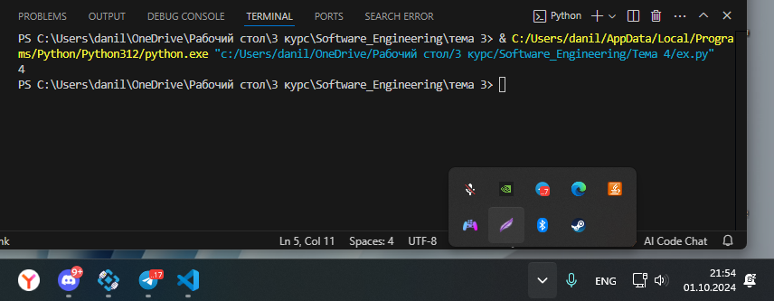

### Выводы

`if __name__ == '__main__':` точка входа

## №2


```python
def main():
    result = 2 + 2
    return result

if __name__ == '__main__':
    answer = main()
    print(answer)
```
### Результат.

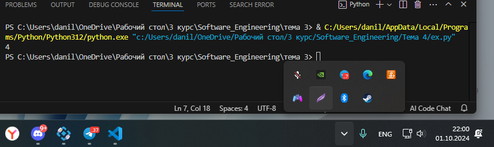

### Выводы

`if __name__ == '__main__':` точка входа
переменной answer передали результат функции main

##  №3


```python
def main(one, two):
    result = one + two
    return result

for i in range(5):
    x = 1
    y = 10
    answer = main(x, y)
    print(answer)
```
### Результат.

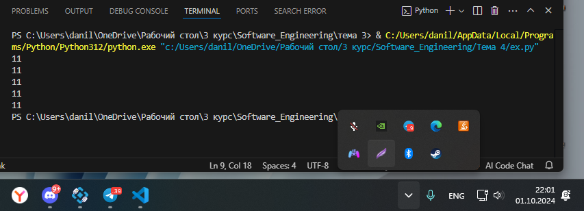

### Выводы

`def main(one, two):` функция с двумя аргументами
  
##  №4


```python
def main(x, *args):
    one = x
    two = sum(args)
    three = float(len(args))
    print(f"one={one}\ntwo={two}\nthree={three}")

    return x + sum(args) / float(len(args))

if __name__ == '__main__':
    result = main(10, 0, 1, 2, -1, 0, -1, 1, 2)
    print(f"\nresult={result}")
```
### Результат.

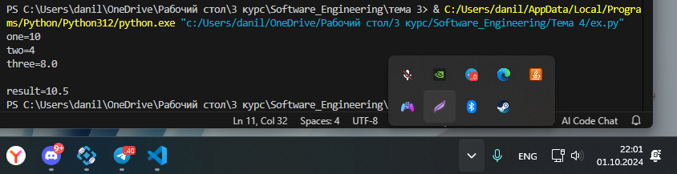

### Выводы

`def main(x, *args):` функция с двумя аргументами, второй аргумент массив 

## №5


```python
def main(**kwargs):
    for i in kwargs.items():
        print(i[0], i[1])

    print()

    for key in kwargs:
        print(f"{key} = {kwargs[key]}")

if __name__ == '__main__':
    main(x=[1, 2, 3], y=[3, 3, 0], z=[2, 3, 0], q=[3, 3, 0], w=[3, 3, 0])
    print()

    main(**{'x': [1, 2, 3], 'y': [3, 3, 0]})
```
### Результат.

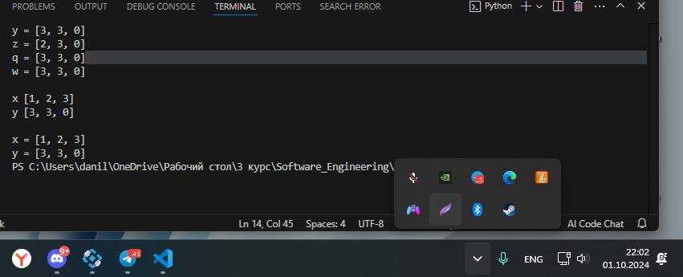

### Выводы

1. def main(**kwargs): функция с картежом в качестве аргумента
2. for i in kwargs.items(): проходимся по предметам
3. for key in kwargs: проходимся по ключам

## №6


```python
def main(**kwargs):
    for i, j in kwargs.items():
        print(f"{i}. Mean = {mean(j)}")
        
def mean(data):
    return sum(data) / float(len(data))

if __name__ == '__main__':
    main(x=[1, 2, 3], y=[3, 3, 0])
```
### Результат.

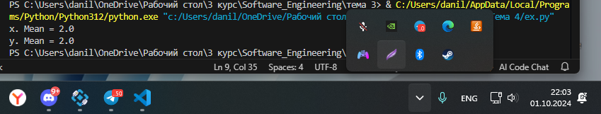

### Выводы

def main(**kwargs): функция с картежом в качестве аргумента

## №7


```python
def say_hello():
    print('Hello students')
```

```python
from for_import import say_hello

if __name__ == '__main__':
    say_hello()
```

### Результат.

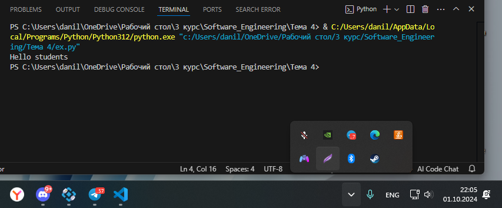

### Выводы

from for_import import say_hello импортируем наш файл и метод

## №8


```python
import math

def main():
    value = int(input('ВВедите значение: '))
    print(math.sqrt(value))
    print(math.sin(value))
    print(math.cos(value))

if __name__ == '__main__':
    main()
```
### Результат.

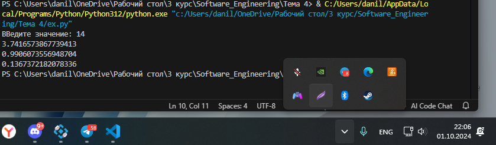

### Выводы

импортируем math

## №9

```python
from datetime import datetime as dt
from datetime import timedelta as td

def main():
    print(
        f"Сегодня {dt.today().date()}. "
        f"День недели - {dt.today().isoweekday()}"
    )
    n = int(input('Введите количество дней: '))
    today = dt.today()
    result = today + td(days=n)
    print(
        f"Через {n} дней будет {result.date()}. "
        f"День недели - {result.isoweekday()}"
    )

if __name__ == '__main__':
    main()
```
### Результат.

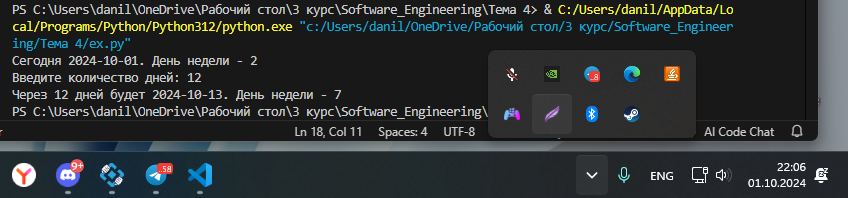

### Выводы

производим импорт datetime и timedelta и инициализируем их

## №10


```python
global result

def rectangle():
    a = float(input("Ширина: "))
    b = float(input("Высота: "))
    global result
    result = a * b

def triangle():
    a = float(input("Основание: "))
    h = float(input("Высота: "))
    global result
    result = 0.5 * a * h

figure = input("1-прямоугольник, 2-треугольник: ")

if figure == '1':
    rectangle()
elif figure == '2':
    triangle()

print(f"Площадь: {result}")
```
### Результат.

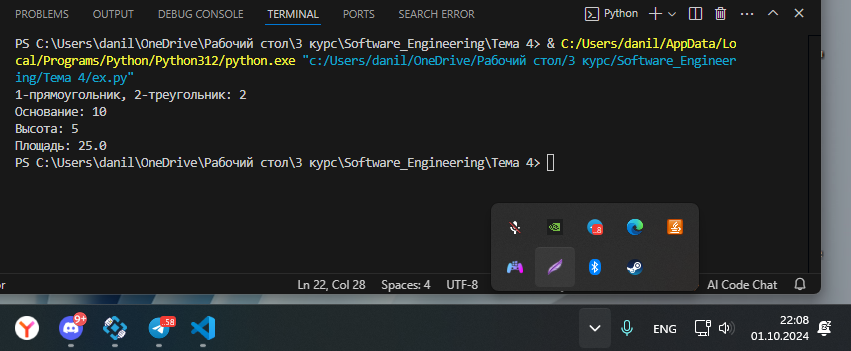

### Выводы

вызывем функции в зависимости от результата

## Самостоятельная работа №1
.

```python
from datetime import datetime #импортируем время
from math import sqrt 

def main(**kwargs): #функция с картежом в качестве параметра
    for key in kwargs.items(): #проходимся по предметам
        result = sqrt(key[1][0] ** 2 + key[1][1] ** 2)
        print(result)

if __name__ == '__main__': #точка входа
    start_time = datetime.now() #узнаем настоящее время
    main(
        one=[10, 3],
        two=[5, 4],
        three=[15, 13],
        four=[93, 53],
        five=[133, 15]
    )
    time_costs = datetime.now() - start_time #узнаем затраты времени вычитая из настоящего времени время старта
    print(f"Время выполнения программы - {time_costs}")
```
### Результат.

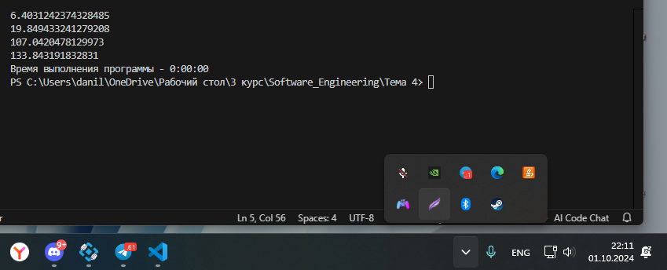

### Выводы


  
## №2


```python
from random import randint

def cube():
    number = randint(1, 6)

    print(f"Значение кубика: {number}")

    if number == 5 or number == 6:
        print("Вы победили")
    elif number == 3 or number == 4:
        cube()
    elif number == 1 or number == 2:
        print("Вы проиграли")

if __name__ == '__main__':
    cube()
```
### Результат.

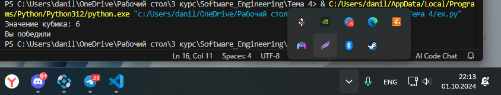

### Выводы

импортируем метод randint 
опеределяем диапозон 
и конструкцией if else выполняем нужные нам операции
  
##  №3


```python
import time
from datetime import datetime

duration = 5

for i in range(duration):
    current_time = datetime.now()
    print("Текущее время:", current_time)

    time.sleep(1)
```
### Результат.

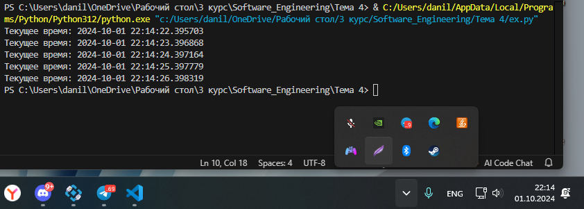

### Выводы

импортируем время конструкцией time.sleep даём указание ожидать после прохода цикла
  
## №4


```python
def main(*args):
    return sum(args) / len(args)

if __name__ == '__main__':
    print(main(1, 2, 3))
```
### Результат.

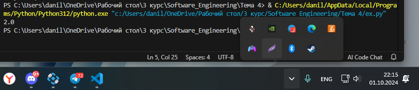

### Выводы

`return sum(args) / len(args)` возвращаем среднее арифметическое
  
## №5


```python
from square import square

if __name__ == '__main__':
    a = int(input())
    b = int(input())
    c = int(input())

    print(square(a, b, c))
```

```python
from math import sqrt

def square(a, b, c):
    p = (a + b + c) / 2
    return sqrt(p * (p - a) * (p - b) * (p - c))
```

### Результат.


### Выводы

`from square import square` импортируем наш файл и метод

## Общие выводы по теме
Научился писать свои методы, ставить точку входа.
Научились импортировать методы такие как date time и т.д
Научился писать функции которые принимают аргументы и возвращают результат
