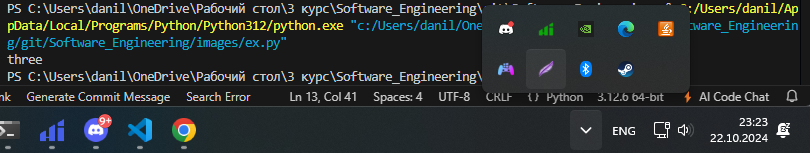
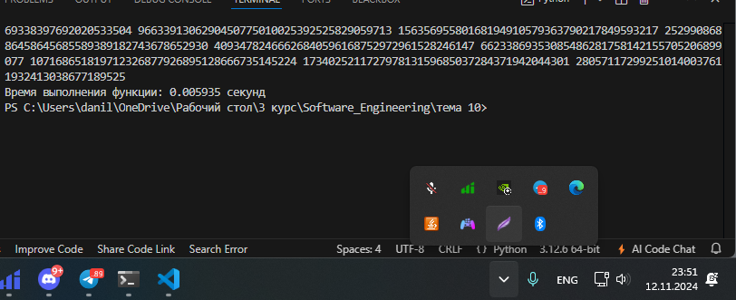
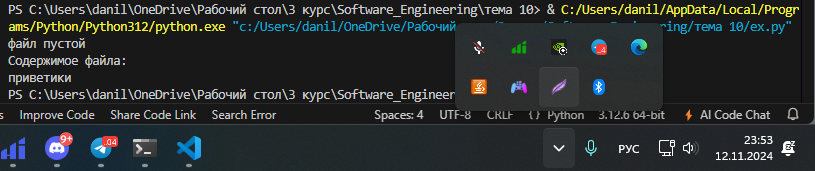

# Тема 5. Базовые коллекции: строки и списки
Отчет по Теме #5 выполнил:
- Галанов Данил Николаевич
- ПИЭ-22-1

| Задание | Лаб_раб | Сам_раб |
| ------ |---------|---------|
| Задание 1 | +       | +       |
| Задание 2 | +       | +       |
| Задание 3 | +       | +       |
| Задание 4 | +       | +       |
| Задание 5 | +       | +       |
| Задание 6 | +       | -       |
| Задание 7 | +       | -       |
| Задание 8 | +       | -       |
| Задание 9 | +       | -       |
| Задание 10 | +       | -       |

знак "+" - задание выполнено; знак "-" - задание не выполнено;

Работу проверили:
- к.э.н., доцент Панов М.А.

## Лабораторная работа №1

```python
set_1 = {'White', 'Black', 'Red', 'Pink'}
set_2 = {'Red', 'Green', 'Blue', 'Red'}

print(set_1 - set_2)
```
### Результат.


### Выводы

Повторяющиеся элементы вычитаем из второго 

## №2


```python
a = set('abcdefg')
print(a)
for i in range(1, 5):
    a.add(i)
print(a)
```
### Результат.


### Выводы

в сет добвляем цифры помимо букв можем использовать конструкцию метод add

## №3


```python
def replace(input_list):
    memory = input_list[0]
    input_list[0] = input_list[-1]
    input_list[-1] = memory

    return input_list

print(replace([1, 2, 3, 4, 5]))
```
### Результат.


### Выводы

меняем места первый и второй элемент тем самым проходясь по списку полностью разворачиваем его
  
## №4


```python
a = [12, 54, 32, 57, 843, 2346, 765, 75, 25, 234, 756, 23]
print(a[2:6])
```
### Результат.


### Выводы

выводит элементы в диспазоне индексов от 2 до 6

## №5


```python
def useless(lst):
    return max(lst) / len(lst)

print(useless([3, 5, 7, 3, 33]))
print(useless([-12.5, 54, 77.3, 0, -36, 98.2, -63, 21.7, 47, -89.6]))
print(useless([-25.8, 86, 12.5, -56, 73.2, 0, 43, -91.5, 65.9, -7]))
```
### Результат.


### Выводы

максимальное делим на длину списка

## №6


```python
superheroes = ['superman', 'spiderman', 'batman']

nikolay, vasiliy, ivan = superheroes

print('Николай - ', nikolay)
print('Василий - ', vasiliy)
print('Иван - ', ivan)
```
### Результат.


### Выводы

приравнивает переменным значение элментов списка  с первого и так далее

## №7


```python
a = [-25.8, 86, 12.5, -56, 73.2, 0, 43, -91.5, 65.9, -7]
a.sort()
print('Отсортированный список:\n', a)
a.pop(0)
print('Отсортированный список без наименьшего элемента:\n', a)
```

### Результат.


### Выводы

отсортировали список по возрастанию и удалили первый элемент списка

## №8

```python
from random import randint

def list_maker():
    a = [randint(1, 100)] * randint(3, 10)
    return a

result = []
for i in range(randint(1, 5)):
    result.append(list_maker())

print(result)
```
### Результат.


### Выводы

создал несколько списков в списке

## №9


```python
def superset(set_1, set_2):
    if set_1 > set_2:
        print(f'Обьект {set_1} является чистым супермножеством')
    elif set_1 == set_2:
        print(f'Множества равны')
    elif set_1 < set_2:
        print(f'Обьект {set_2} является чистым супермножеством')
    else:
        print('Супермножество не обнаружено')

superset({1, 8, 3, 5}, {3, 5})
superset({1, 8, 3, 5}, {5, 3, 8, 1})
superset({3, 5}, {5, 3, 8, 1})
superset({90, 100}, {3, 5})
```
### Результат.



### Выводы

в зависимости от условий вывод в консоль

## №10


```python
my_list = [2, 5, 8, 3]
print(my_list[::-1])
```
### Результат.


### Выводы

список в обратном порядке

## Самостоятельная работа №1


```python
from collections import Counter

a = [8734, 2345, 8201, 6621, 9999, 1234, 5678, 8201, 8888, 4321, 3365, 1478, 9865, 5555, 7777, 9998, 1111, 2222, 3333, 4444, 5556, 6666, 5410, 7778, 8889, 4445, 1439, 9604, 8201, 3365, 7502, 3016, 4928, 5837, 8201, 2643, 5017, 9682, 8530, 3250, 7193, 9051, 4506, 1987, 3365, 5410, 7168, 7777, 9865, 5678, 8201, 4445, 3016, 4506, 4506]

print(len(a))
print(len(set(a)))
print(Counter(a).most_common(1)[0][0])
```
### Результат.



### Выводы

 from collections import Counter импортируем counter
 print(len(a)) узнаем кол-во элементов
 print(len(set(a))) при помощи set узнаем кол-во уникальных элементов
 Используем Counter для подсчета частоты каждого элемента в списке a. Метод most_common(1) возвращает список из одного кортежа, содержащего самый часто встречающийся элемент и его частоту. [0][0] извлекает сам элемент (без частоты). Это позволяет определить, какое число встречается чаще всего в списке.
  
## №2


```python
a = [10.2, 14.8, 19.3, 22.7, 12.5, 33.1, 38.9, 21.6, 26.4, 17.1, 30.2, 35.7, 16.9, 27.8, 24.5, 16.3, 18.7, 31.9, 12.9, 37.4]
a_s = sorted(a)

print(a_s[0:4])
print(a_s[-3:])
print(a[10:])
```
### Результат.



### Выводы

  
## №3


```python
from math import sqrt

one = [12, 25, 3, 48, 71]
two = [5, 18, 40, 62, 98]
three = [4, 21, 37, 56, 84]

m1 = (max(one) + max(two) +max(three)) / 2
m2 = (min(one) + min(two) +min(three)) / 2

max_square = sqrt(m1 * (m1 - max(one)) * (m1 - max(two)) * (m1 - max(three)))
min_square = sqrt(m2 * (m2 - min(one)) * (m2 - min(two)) * (m2 - min(three)))

print(max_square)
print(min_square)
```
### Результат.


### Выводы

Вычисляем полупериметры для максимальных и минимальных элементов из списков.
Используем формулу Герона для вычисления площадей.
Выводим площади для сравнения.

  
## №4

```python
first = [2, 3, 4, 5, 3, 4, 5, 2, 2, 5, 3, 4, 3, 5, 4]
second = [4, 2, 3, 5, 3, 5, 4, 2, 2, 5, 4, 3, 5, 3, 4]
third = [5, 4, 3, 3, 4, 3, 3, 5, 5, 3, 3, 3, 3, 4, 4]

def modify_grades(nums):
    return [4 if num == 3 else
            num for num in nums 
            if num != 2]

print(modify_grades(first))
print(modify_grades(second))
print(modify_grades(third))
```
### Результат.


### Выводы
Выводы
Функция modify_grades обрабатывает списки оценок.
В списках все оценки 3 заменяются на 4, что может указывать на улучшение оценок.
Оценки 2 удаляются из списков, возможно, для исключения неудовлетворительных результатов.
Функция применяется к каждому из трех списков, и выводятся обновленные списки.
  
## №5


```python
list_1 = [1, 1, 3, 3, 1]
list_2 = [5, 5, 5, 5, 5, 5, 5]
list_3 = [2, 2, 1, 2, 2, 5, 6, 7, 1, 3, 2, 2]

def string_set(lst):
    result_set = set()
    map = {}

    for num in lst:
        map[num] = map.get(num, 0) + 1

    for num, count in map.items():
        result_set.add(num)
        for i in range(2, count + 1):
            result_set.add(str(num) * i)

    return result_set

print(string_set(list_1))
print(string_set(list_2))
print(string_set(list_3))
```

### Результат.


### Выводы
Функция string_set обрабатывает список чисел и возвращает множество, содержащее числа и их строковые повторения.
Внутри функции создается словарь map, подсчитывающий количество вхождений каждого числа.
В первом цикле по списку lst функция заполняет словарь map, где ключ — число, а значение — его количество вхождений.
Во втором цикле по элементам словаря map:
Число добавляется в множество result_set.
Если число встречается более одного раза, добавляются его строковые повторения (например, '11' для числа 1, если оно встречается два раза).


## Общие выводы по теме
поработал с функциями, которые обрабатывают списки и множества, узнал про методы списков и множеств

