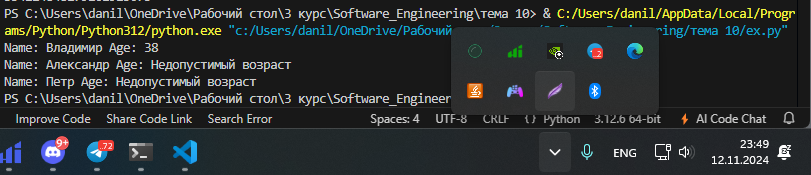
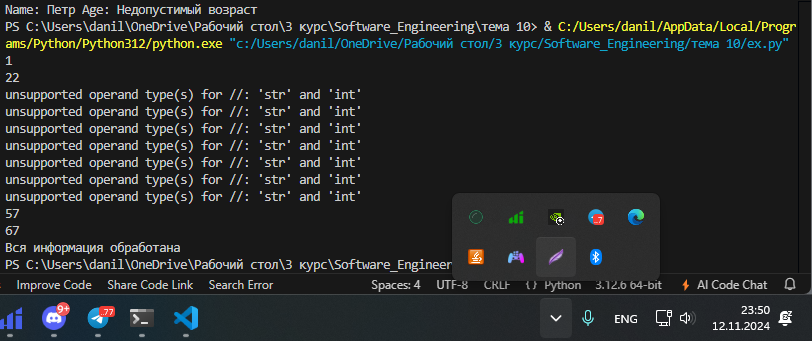
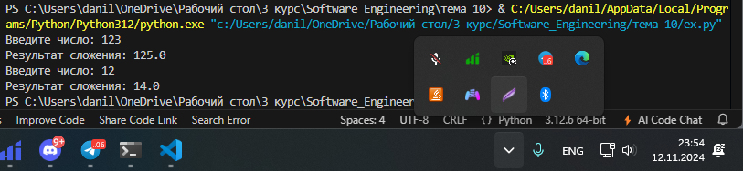

# Тема 6. Базовые коллекции: словари, кортежи
Отчет по Теме #6 выполнил:
- Галанов Данил Николаевич
- ПИЭ-22-1

| Задание | Лабораторная работа | Самостоятельная работа |
| ------ |---------|---------|
| Задание 1 | +       | +       |
| Задание 2 | +       | +       |
| Задание 3 | +       | +       |
| Задание 4 | +       | +       |
| Задание 5 | +       | +       |

знак "+" - задание выполнено; знак "-" - задание не выполнено;

Работу проверили:
- к.э.н., доцент Панов М.А.

## Лабораторная работа №1


```python
request = int(input('Введите номер кабинета: '))

dictionary = {
    101: {'key': 1234, 'access': True},
    102: {'key': 1337, 'access': True},
    103: {'key': 8943, 'access': True},
    104: {'key': 5555, 'access': False},
    None: {'key': None, 'access': False},
}

response = dictionary.get(request)

if not response:
    response = dictionary[None]
key = response.get('key')
access = response.get('access')
print(key, access)
```
### Результат.


### Выводы

Используем словарь

## №2


```python
from pprint import pprint

my_dict = {'first': 'so easy'}

def dict_maker(**kwargs):
    my_dict.update(**kwargs)

dict_maker(a1=1, a2=20, a3=54, a4=13)
dict_maker(name='Михаил', age=31, weight=70, eyes_color='blue')
pprint(my_dict)
```
### Результат.



### Выводы

Модуль pprint позволяет выводить большие объемы данных в более читаемом виде, удобном для восприятия. Он форматирует сложные структуры данных, такие как списки и словари, делая их более организованными и легко читаемыми. Это может быть особенно полезно при отладке или выводе длинных и вложенных структур.

## №3


```python
input_string = 'HelloWorld'
result = tuple(input_string)
print(result)
print(list(result))
```
### Результат.



### Выводы


Мы можем использовать кортежи (tuple), обернув строку в кортеж.
После этого её можно преобразовать в список (аналогично split()) или продолжить работу с кортежем напрямую.
  
## №4


```python
def personal_info(name, age, company='unnamed'):
    print(f"Имя: {name} Возраст: {age} Компания: {company}")
    
tom = ("Григорий", 22)
personal_info(*tom)

bob = ("Георгий", 41, "Yandex")
personal_info(*bob)
```
### Результат.


### Выводы

На вход поступает кортеж

## №5


```python
def tuple_sort(tpl):
    for elm in tpl:
        if not isinstance(elm, int):
            return tpl
    return tuple(sorted(tpl))

print(tuple_sort((5, 5, 3, 1, 9)))
print(tuple_sort((5, 5, 2.1, '1', 9)))
```
### Результат.


### Выводы

Функция, сортирующая кортеж с целыми числами по возрастанию.
Если в кортеже есть нецелое число, возвращается исходный кортеж.

## Самостоятельная работа №1


```python
s = input()

my_list = s.split(" ")
my_dict = tuple(s.replace(" ", ""))

print(my_list)
print(my_dict)
```
### Результат.


### Выводы

1. `my_list = s.split(" ")` разделяем строку по пробелам при помощи сплит
2. `my_dict = tuple(s.replace(" ", ""))` удаляем пробелы и приводим к виду tuple
  
## №2


```python
def delete_element(tup, value):
    filtered_list = [x for x in tup if x != value]
    return tuple(filtered_list)

original_tuple = (1, 2, 3, 4, 5)
value_to_delete = 3

updated_tuple = delete_element(original_tuple, value_to_delete)
print("Обновленный кортеж:", updated_tuple)

```
### Результат.


### Выводы

Функция удаляет заданный элемент из кортежа и возвращает обновлённый кортеж
  
## №3


```python
from collections import Counter

def top_three_digits(s):
    digit_frequency = Counter(int(d) for d in s)
    common_digits = digit_frequency.most_common(3)
    sorted_digits = sorted(common_digits)

    frequency_dict = {digit: count for digit, count in sorted_digits}

    return frequency_dict

string_input = "1234567890123456789012345"
output = top_three_digits(string_input)

print("Три самых частых цифры и их количество:", output)

```
### Результат.



### Выводы

Функция находит три самых частых цифры в строке:

Counter — считает частоту каждого символа.
most_common(3) — возвращает три наиболее частых элемента.
sorted() — сортирует результаты по возрастанию.
Возвращается словарь с цифрами и их частотой.
  
## №4


```python
def get_subtuple(tup, value):
    if value not in tup:
        return ()

    start_index = tup.index(value)

    try:
        end_index = tup.index(value, start_index + 1)
        return tup[start_index:end_index + 1]
    except ValueError:
        return tup[start_index:]

sample_tuple = (1, 2, 3, 4, 5, 3, 6, 7, 3, 8, 9)
value_to_search = 3

subtuple_result = get_subtuple(sample_tuple, value_to_search)
print("Подкортеж:", subtuple_result)

```
### Результат.


### Выводы
Функция извлекает подкортеж на основе указанного значения:

Проверка на наличие значения — если его нет, возвращается пустой кортеж.
index() — находит первый индекс значения.
Обработка исключений — пытается найти второй индекс; если не удаётся, возвращает подкортеж от первого индекса до конца.
Возвращается найденный подкортеж.
  
## №5
.

```python
def summarize_strings(strings):
    descriptions = []

    for s in strings:
        if not s:
            descriptions.append("Пустая строка")
        else:
            descriptions.append(f"Строка длиной {len(s)} символов")

    return descriptions


# Тестовые данные
sample1 = ["hi", "как ты", "Python", ""]
sample2 = ["", "", "мда", "12345"]
sample3 = ["Кошка", "Кит", "Мышь", ""]

# Проверка работы функции
output1 = summarize_strings(sample1)
output2 = summarize_strings(sample2)
output3 = summarize_strings(sample3)

print("Тест 1:", output1)
print("Тест 2:", output2)
print("Тест 3:", output3)

```

### Результат.


### Выводы

Функция описывает строки, возвращая их длину:

Проверка на пустую строку — если строка пустая, добавляется "Пустая строка".
len(s) — вычисляет длину непустой строки и формирует описание.
Возвращается список описаний для каждой строки.

## Общие выводы по теме
Освоил работу со словарями, картежами на базовом уровне.