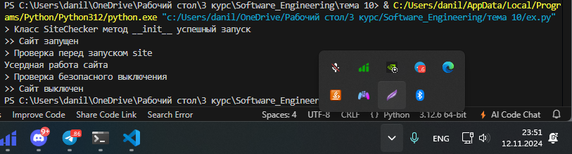
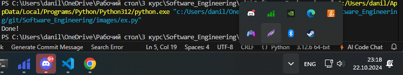

# Тема 7. Работа с файлами (ввод и вывод)
Отчет по Теме #7 выполнил:
- Галанов Данил Николаевич
- ПИЭ-22-1

| Задание    | Лаб_раб | Сам_раб |
|------------|---------|---------|
| Задание 1  | +       | +       |
| Задание 2  | +       | +       |
| Задание 3  | +       | +       |
| Задание 4  | +       | +       |
| Задание 5  | +       | +       |
| Задание 6  | +       | -       |
| Задание 7  | +       | -       |
| Задание 8  | +       | -       |
| Задание 9  | +       | -       |
| Задание 10 | +       | -       |

знак "+" - задание выполнено; знак "-" - задание не выполнено;

Работу проверили:
- к.э.н., доцент Панов М.А.

## Лабораторная работа №1

```python

```
### Результат.


### Выводы

создали файл

## №2

```python
f = open('images/input.txt', 'r')
print(f.readline())
f.close()
```
### Результат.


### Выводы

прочитали строку

## №3

```python
f = open('images/input.txt', 'r')
print(f.readlines())
f.close()
```
### Результат.


### Выводы

прочитали строки
  
## №4


```python
with open('images/input.txt', 'r') as f:
    print(f.readlines())
```
### Результат.


### Выводы

открыли с помощью with

## №5


```python
with open('images/input.txt') as f:
    for line in f:
        print(line)
```
### Результат.



### Выводы

прошлись по строкам используя цикл

## №6


```python
with open('images/input.txt', 'a+') as f:
    f.write('\nIm additional line')

with open('images/input.txt', 'r') as f:
    result = f.readlines()
    print(result)
```
### Результат.


### Выводы

`with open('input.txt', 'a+') as f:` добавить в файл
`with open('input.txt', 'r') as f:` чтение из файла

## №7


```python
lines = ['one', 'two', 'three']
with open('images/input.txt', 'w') as f:
    for line in lines:
        f.write('\nCycle run ' + line)
    print('Done!')
```
### Результат.



### Выводы

`with open('input.txt', 'w') as f:` перезапись файла

## №8


```python
import os

def print_docs(directory):
    all_files = os.walk(directory)
    for catalog in all_files:
        print(f'Папка {catalog[0]} содержит:')
    print(f'Директории: {", ".join([folder for folder in catalog[1]])}')
    print(f'Файлы: {", ".join([file for file in catalog[2]])}')
    print('-' * 48)

print_docs('D:\Epic Games')
```
### Результат.


### Выводы

os позволяет пройтись по директориям

## №9


```python
def longest_words(file):
    with open(file, encoding='utf-8') as f:
        words = f.read().split()
        max_length = len(max(words, key=len))
        for word in words:
            if len(word) == max_length:
                sought_words = word

        if len(sought_words) == 1:
            return sought_words[0]
        return sought_words

print(longest_words('images/input.txt'))
```
### Результат.


### Выводы

выводит слово, имеющее максимальную длину

## №10


```python
import csv
import datetime
import time

with open('rows_300.csv', 'w', encoding='utf-8', newline='') as f:
    writer = csv.writer(f)
    writer.writerow(['№', 'Секунда', 'Микросекунда'])
    for line in range(1, 301):
        writer.writerow([line, datetime.datetime.now().second,
                         datetime.datetime.now().microsecond])
        time.sleep(0.01)
```
### Результат.


### Выводы

создали csv-файл «rows_300.csv»

## Самостоятельная работа №1
```python
from collections import Counter
import re

def analyze_file(file_name):
    with open(file_name, 'r', encoding='utf-8') as f:
        content = f.read().lower()
        found_words = re.findall(r'\b\w+\b', content)
        word_stats = Counter(found_words)
        frequent_word = word_stats.most_common(1)[0]
    return len(found_words), frequent_word

word_total, frequent_word = analyze_file("images/input.txt")
print(f"Количество всех слов: {word_total}")
print(f"Часто встречающееся слово: '{frequent_word[0]}', встречается: {frequent_word[1]} раз(а)")

```
### Результат.


### Выводы

1. Читаем файл и приводим текст к нижнему регистру
2. Используем регулярное выражение для поиска слов
3. Подсчитываем количество вхождений каждого слова
4. Находим самое частое слово
  
## №2

```python
def log_expense(file_name):
    with open(file_name, 'a', encoding='utf-8') as f:
        entry = input("Введите описание и сумму расхода: ")
        f.write(entry + "\n")

def display_expenses(file_name):
    with open(file_name, 'r', encoding='utf-8') as f:
        all_expenses = f.readlines()
        if all_expenses:
            print("Список расходов:")
            for item in all_expenses:
                print(item.strip())
        else:
            print("Расходы отсутствуют.")

log_expense("images/expenses.txt")
log_expense("images/expenses.txt")
log_expense("images/expenses.txt")
display_expenses("images/expenses.txt")

```
### Результат.


### Выводы

1.  Записываем строку в файл
2.  Выводим каждую строку
  
## №3


```python
import re

def analyze_text(file_name):
    with open(file_name, 'r', encoding='utf-8') as f:
        content_lines = f.readlines()
        line_count = len(content_lines)
        word_count = 0
        letter_count = 0

        for content in content_lines:
            word_list = content.split()
            word_count += len(word_list)
            letter_count += len(re.findall(r'[a-zA-Z]', content))

        print(f"Латинские буквы: {letter_count}")
        print(f"Слова: {word_count}")
        print(f"Строки: {line_count}")

analyze_text("images/input.txt")

```
### Результат.


### Выводы

1. Читаем все строки файла
2. Разбиваем строку на слова
3. Считаем слова
4. Используем регулярное выражение для поиска латинских букв
  
## №4


```python
import re

def get_forbidden_words(file_name):
    with open(file_name, 'r', encoding='utf-8') as f:
        restricted_words = f.read().split()
    return restricted_words

def censor_text(text, restricted_words):
    for restricted in restricted_words:
        pattern = re.compile(re.escape(restricted), re.IGNORECASE)
        text = pattern.sub('*' * len(restricted), text)
    return text

restricted_words = get_forbidden_words("images/input.txt")

user_input = input("Введите предложение для проверки: ")

censored_text = censor_text(user_input, restricted_words)

print("Отцензурированный результат:", censored_text)

```
### Результат.


### Выводы

1. Чтение и разбиение строки на слова
2. Создаем регулярное выражение для поиска запрещенных слов независимо от регистра
3. Замена на звездочки
4. Чтение списка запрещённых слов из файла
  
## №5
### Самостоятельно придумайте и решите задачу, которая будет
### взаимодействовать с текстовым файлом.

```python
def load_reviews(file_name):
    """Загружает отзывы из файла"""
    with open(file_name, 'r', encoding='utf-8') as f:
        reviews = f.readlines()
    return reviews

def analyze_reviews(reviews, positive_keywords, negative_keywords):
    """Анализирует отзывы и возвращает статистику"""
    total_reviews = len(reviews)
    total_words = 0
    positive_count = 0
    negative_count = 0

    for review in reviews:
        words = review.split()
        total_words += len(words)

        # Определяем, является ли отзыв положительным или отрицательным
        if any(word.lower() in review.lower() for word in positive_keywords):
            positive_count += 1
        elif any(word.lower() in review.lower() for word in negative_keywords):
            negative_count += 1

    avg_words = total_words / total_reviews if total_reviews > 0 else 0
    positive_percentage = (positive_count / total_reviews) * 100 if total_reviews > 0 else 0
    negative_percentage = (negative_count / total_reviews) * 100 if total_reviews > 0 else 0

    return total_reviews, avg_words, positive_count, negative_count, positive_percentage, negative_percentage

def display_statistics(total_reviews, avg_words, positive_count, negative_count, positive_percentage, negative_percentage):
    """Выводит статистику по отзывам"""
    print(f"Общее количество отзывов: {total_reviews}")
    print(f"Средняя длина отзыва: {avg_words:.2f} слов")
    print(f"Положительных отзывов: {positive_count} ({positive_percentage:.2f}%)")
    print(f"Отрицательных отзывов: {negative_count} ({negative_percentage:.2f}%)")

# Ключевые слова для анализа
positive_keywords = ["отличный", "прекрасный", "рекомендую", "доволен"]
negative_keywords = ["ужасное", "разочарован", "не понравилось", "совсем не то"]

# Загрузка и анализ отзывов
reviews = load_reviews("images/input.txt")
total_reviews, avg_words, positive_count, negative_count, positive_percentage, negative_percentage = analyze_reviews(reviews, positive_keywords, negative_keywords)

# Вывод статистики
display_statistics(total_reviews, avg_words, positive_count, negative_count, positive_percentage, negative_percentage)

```

### Результат.


### Выводы

Функция load_reviews() загружает отзывы из текстового файла.
Функция analyze_reviews() подсчитывает количество слов, определяет, являются ли отзывы положительными или отрицательными, и вычисляет процент.
Функция display_statistics() выводит собранную статистику.

## Общие выводы по теме
поработали с файлами в питоне
